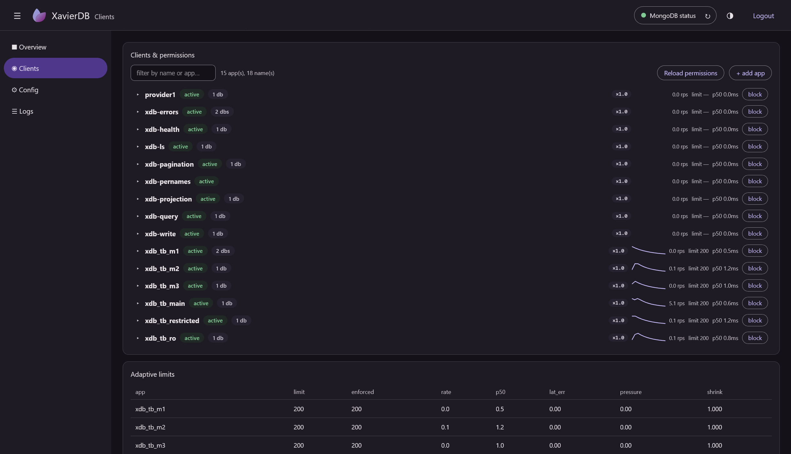

#  XavierDB - Just less than MongoDB

<p align="center">
  
</p>

> A small, fast HTTP server that exposes a **MongoDB database through a REST API**
> with per-client authentication, granular permissions, adaptive load control
> and a live admin dashboard.

[](https://www.rust-lang.org/)
[](https://developer.mozilla.org/en-US/docs/Web)
[](https://www.mongodb.com/)
[](https://www.docker.com/)
[](https://opensource.org/licenses/MIT)
[](https://github.com/ThomasByr)

| Method                    | Path             | Purpose                                                      |
| ------------------------- | ---------------- | ------------------------------------------------------------ |
| POST                      | `/auth`          | client login  -> JWT (+ HttpOnly cookie)                     |
| GET/POST/PUT/PATCH/DELETE | `/q/<db>/<coll>` | MongoDB proxy                                                |
| GET                       | `/ls`            | list databases the caller may read (?db=<db> -> collections) |
| GET                       | `/dashboard/`    | admin dashboard (login protected)                            |
| GET                       | `/health`        | cached health document (public)                              |

1. [Quick start (Docker)](#quick-start-docker)
2. [Documentation](#documentation)
3. [Examples](#examples)
4. [Development](#development)
5. [Tests](#tests)

## Quick start (Docker)

Prerequisites: Docker with Compose v2 (e.g. Docker Desktop).

```bash
docker compose up --build -d
```

Restarting the API:

```bash
docker compose build --no-cache api
docker compose up -d
```

State persists on the host:

> [!NOTE]
> Put your MongoDB data in `{HOME}/data/xavier-mongo-db` or edit
> [compose.yaml](compose.yaml) to change the volume mount.

The API uses the repo's `.env` as-is. If `PASSWORD_HASH` is blank, the
admin dashboard password is **generated and printed once** in the API
container logs (it is hashed into `.env` — `USERNAME` defaults to `admin`):

```bash
docker compose logs api
```

<details>
<summary>Bare metal (no Docker)</summary>

Prerequisites: Rust (stable), a running MongoDB (default `mongodb://localhost:27017`).

```bash
npm install           # generate src/assets/app.js (dashboard TypeScript -> JS)
npm run build

cp .env.example .env  # edit HOST/PORT/MONGODB_URI if needed
cp authorized_keys.yml.example authorized_keys.yml

cargo run --release
```

The admin dashboard password is **generated and printed once in the
terminal** (it is hashed into `.env` — `USERNAME` defaults to `admin`).

</details>

Then:

1. Open `http://127.0.0.1:8000/dashboard/` and log in.
2. In the dashboard **Clients** view, **add app** → enter an `app_id` and a
   shared token (permissions are edited inline, per app or per name).
   (Or edit `authorized_keys.yml` by hand; the file hot-reloads.)
3. Your clients authenticate:

   ```bash
   curl -X POST http://127.0.0.1:8000/auth \
     -H "Content-Type: application/json" \
     -d '{"identifier":"user1@provider1","token":"my-secret-app-token"}'
   # -> {"token":"eyJ...","token_type":"Bearer","expires_in":5400,...}
   ```

4. Use the token on `/q/`:

   ```bash
   curl "http://127.0.0.1:8000/q/db1/items?limit=10&sort=%7B%22n%22%3A1%7D" \
     -H "Authorization: Bearer eyJ..."
   ```

The token is also returned as an HttpOnly cookie, so browsers can just log in
once per session.

## Documentation

- [ADMIN_GUIDE.md](docs/ADMIN_GUIDE.md) for the dashboard and its API
- [API_REFERENCE.md](docs/API_REFERENCE.md) for the full API reference
- [CONFIGURATION.md](docs/CONFIGURATION.md) for the `.env` and `authorized_keys.yml` formats

## Examples

Runnable Rust client examples live in `examples/` — a standalone crate with
its own lockfile.

Each example is a pair:

- a `setup_*` program that uses the **dashboard API** to create the app id + permissions,
- and a showcase program that exercises the **client API**.

They need a running server and the dashboard password:

```bash
cargo run --manifest-path examples/Cargo.toml --bin setup_projection -- \
    --admin-pass <dashboard-password>
cargo run --manifest-path examples/Cargo.toml --bin projection
```

Read more in the [examples](examples/README.md) README.

## Development

```bash
docker compose watch      # rebuilds the API image on Cargo.toml/src changes
# or, manually (incremental; clean rebuild: docker compose build --no-cache api):
docker compose up --build -d
```

<details>
<summary>Bare metal development</summary>

```bash
npm install        # only for rebuilding the dashboard TypeScript
npm run build      # compiles src/assets/ts/app.ts -> src/assets/app.js
cargo test         # unit + integration tests (tests/ needs a running server + MongoDB)
cargo run
```

</details>

The dashboard is embedded into the binary at compile time — no external files
needed at runtime.

## Tests

Two tiers, both launched with `cargo test` (44 unit + 110 integration = 154):

```bash
cargo test                              # everything: 44 unit + 110 integration
cargo test --bin XavierDB               # inline unit tests only
cargo test --test auth_flow             # one integration suite (12 suites total)
XDB_TEST_MONGO_URI=mongodb://127.0.0.1:27017 cargo test  # + the Mongo-backed
                                        # pagination-equivalence test
```

The whole battery needs the fixture world (6 apps + 8 databases), created once per
machine via the dashboard API:

```bash
bash tests/bootstrap.sh --dash-user <dashboard-user> --dash-pass '<dashboard-password>'
```

It caches JWTs and the admin cookie in the system temp dir (`xdb_tb_cache`),
so a warm run performs no Argon2id logins and stale tokens are refreshed
automatically.
